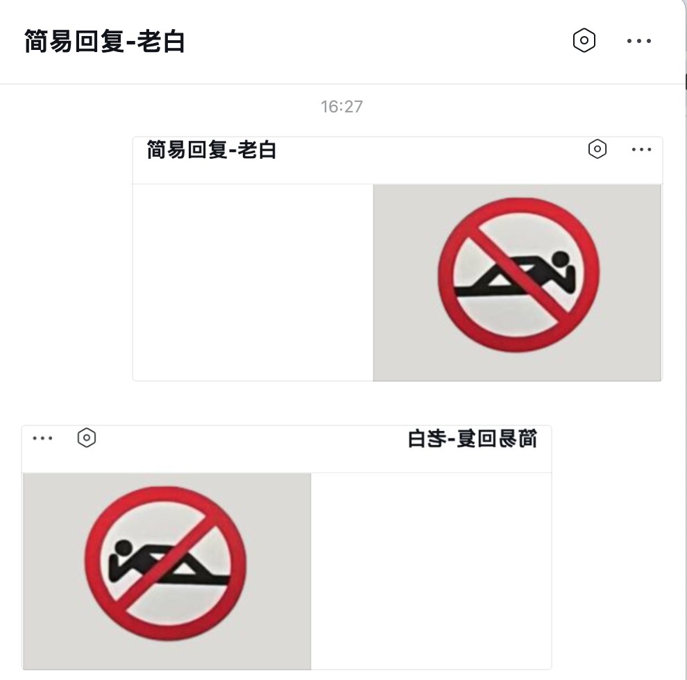

# 企业微信-应用消息回复服务

## 1. 项目介绍

本项目是一个基于 [Flask](https://flask.palletsprojects.com/en/1.1.x/) 的
**企业微信【应用】的自动回复消息的简单服务框架**。
使用者只需要实现两个简单的函数，即可快速搭建一个企业微信应用接收/回复消息的接口服务。

实现过程参考 [微信公众平台开发者文档-基础消息能力/接收普通消息](https://developer.work.weixin.qq.com/document/path/96466)
和
[被动回复用户消息](https://developer.work.weixin.qq.com/document/path/96469)
两个文档进行实现。

## 2. demo 效果

使用 demo/demo.py 中的示例，可以直接将实现一个 ECHO 功能的企业微信应用服务。

这个 Echo 只为简单展示，而你可以基于该框架，实现更多的功能逻辑，甚至像我一样接入大模型，图片横向翻转表示图片处理能力：

## 3. 使用

如果要进行自动回复，需要**企业的管理员**进行创建应用，需要将开发着加成管理员，并且需要一些配置，才可以让企业微信后台将消息转发到我们应用的服务器上。

### 3.1 配置与信息记录

1. 找到企业管理员，获得企业的ID，demo.py 中的 corp_id 需要填这个信息：

2. 找管理员创建一个应用：

3. 配置 URL、Token、AED Key，这里如果服务没有搭建，是不能保存成功的，我们先留住页面，启动服务后来保存：

### 3.2 启动部署服务

1. 登录云主机，创建一个合适的目录，copy demo.py 到该目录下
2. 安装依赖包，`pip install wecom-app-svr`
3. **修改 demo.py**， 修改 corp_id 为上边查询出的 【企业ID】
4. 运行服务，`python demo.py`
5. 回到3.1配置页面，点击【保存】，如果没有报错，说明服务已经启动成功了

### 3.3 测试服务

通过上面的配置，我们已经实现了可以个性化自动回复消息的企业微信-应用的回调服务，能够实现【demo 效果】中展示的功能。

- **Echo功能
  **：在【应用】中发送一条消息，如果服务正常，会收到一条回复的 Echo 消息。文本、图片、语音消息。 目前 demo.py 中支持的 Echo 消息格式只有文本、图片、语音消息，其他消息格式可以自行实现处理逻辑

### 3.4 正式环境使用的注意事项

1. 不要直接使用 ``xxx`` 和 43 个 `x` 作为 Token 和 AES key，要自己生成一个随机的字符串。
2. 也可以代码里不填写 corp ID、Token 以及 AES key，而是通过环境变量的方式进行传递：``WECOM_APP_CORP_ID``、``WECOM_APP_TOKEN``、``WECOM_APP_AES_KEY``，这样可以避免
   代码泄露带来的风险。
3. 因为服务框架相对简单，没有做太多的安全和性能措施，建议配合自己的安全网关一起使用。比如我使用的 127.0.0.1:5001 作为服务的监听地址，
   然后通过 Nginx做反向代理，同时做一些安全控制。

## 4. 支持消息说明

当前已经封装了企业微信-应用-官网支持的[6种消息类型](https://developers.weixin.qq.com/doc/offiaccount/Message_Management/Receiving_standard_messages.html)，具体的结构详见[req_msg.py](src%2Fwx_mp_svr%2Freq_msg.py)：

- 文本消息
- 图片消息
- 语音消息
- 视频消息
- 地理位置消息
- 链接消息

可以立即回复的消息类型，也与官网支持的[6种消息类型](https://developers.weixin.qq.com/doc/offiaccount/Message_Management/Passive_user_reply_message.html)一致，具体结构见[passive_rsp_msg.py](src%2Fwx_mp_svr%2Fpassive_rsp_msg.py):

- 文本消息
- 图片消息
- 语音消息
- 视频消息
- 音乐消息
- 图文消息

## 其他说明

1. 因为这里的需要配置【服务器地址URL】，如果你只有中国国内的云主机，还需要一个备案的域名，不然会被云厂商拦截请求；如果是中国境外的云主机则无此限制。具体的原因有兴趣的可以参考我的文章:《[网站不备案是否能够访问？](https://panzhongxian.cn/cn/2022/10/build-personal-blog-step-by-step/#%E5%85%AD%E7%BD%91%E7%AB%99%E4%B8%8D%E5%A4%87%E6%A1%88%E6%98%AF%E5%90%A6%E8%83%BD%E5%A4%9F%E8%AE%BF%E9%97%AE)》
2. 如有任何问题欢迎提 Issue，也可以关注 知乎/公众号【老白码农在奋斗】留言咨询。